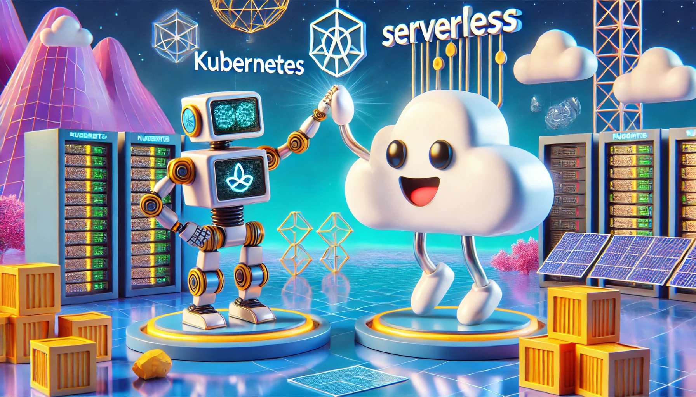

# AWS CDK - EKS Boilerplate Deployment

This AWS CDK project deploys an Amazon Elastic Kubernetes Service (EKS) cluster along with essential infrastructure components. The deployment consists of two stages:

1. **Infrastructure Base** - Sets up foundational infrastructure, including an Amazon Elastic Container Registry (ECR).
2. **Infrastructure** - Deploys an EKS cluster with GPU-enabled nodes, IAM roles, namespaces, and workloads.



## Prerequisites

Ensure you have the following installed before proceeding:

- [AWS CDK](https://docs.aws.amazon.com/cdk/v2/guide/getting_started.html) (>= v2)
- [AWS CLI](https://aws.amazon.com/cli/)
- Python (>= 3.8) with `pip`
- Docker (for container image builds)

## Project Structure

```
├── infrastructure_base
│   ├── app.py
│   ├── infrastructure_base_stack.py
│   ├── cdk.json
│   ├── requirements.txt
│
├── infrastructure
│   ├── app.py
│   ├── infrastructure_stack.py
│   ├── cdk.json
│   ├── requirements.txt
│
└── README.md
```

## Deployment Instructions

### Step 1: Bootstrap CDK
If you haven't already, bootstrap the AWS CDK environment:
```sh
cdk bootstrap
```
This ensures CDK has the necessary resources to deploy infrastructure.

### Step 2: Deploy Infrastructure Base
Deploy the base infrastructure that includes the ECR repository:
```sh
cd infrastructure_base
pip install -r requirements.txt
cdk deploy
```
After deployment, take note of the **ECR Repository URI** output. It will be required by the next deployment.

### Step 3: Deploy Infrastructure
Once the infrastructure base is deployed, deploy the EKS cluster and workloads:
```sh
cd ../infrastructure
pip install -r requirements.txt
cdk deploy
```
This step creates an EKS cluster, GPU node group, IAM roles, Kubernetes namespaces, and essential workloads.

## Key Components

### **Infrastructure Base**
- **Amazon ECR** - A container registry to store Docker images.

### **Infrastructure**
- **Amazon EKS Cluster** - Managed Kubernetes cluster running v1.31.
- **Amazon EC2 GPU Node Group** - Uses `g4dn.xlarge` instances for GPU workloads.
- **IAM Roles** - Roles for worker nodes and cluster management.
- **Kubernetes Namespaces**:
  - `<DATAPLATFORM_NAMESPACE>` - For AI and data services.
- **Kubernetes Workloads**:
  - **Metrics Server** - Provides resource utilization metrics.
  - **NVIDIA Device Plugin** - Enables GPU support in Kubernetes.
  - **Dataplatform Service** - AI-powered data platform using GPU resources.

## Post-Deployment Verification

1. Configure kubectl locally:
   ```sh
   export KUBECONFIG=~/.kube/config
   mkdir -p ~/.kube
   aws eks update-kubeconfig --region <AWS_REGION> --name <EKS_CLUSTER_NAME>
   ```
2. Verify EKS Cluster:
   ```sh
   kubectl get nodes
   ```
3. Check Kubernetes Workloads:
   ```sh
   kubectl get pods -n <NAMESPACE>
   ```
4. View Load Balancer Services:
   ```sh
   kubectl get svc -n <NAMESPACE>
   ```
5. Describe a specific pod:
   ```sh
   kubectl describe pod <POD_NAME> -n <NAMESPACE>
   ```
6. Delete and redeploy a pod:
   ```sh
   kubectl delete pod <POD_NAME> -n <NAMESPACE>
   kubectl rollout restart deployment <DEPLOYMENT_NAME> -n <NAMESPACE>
   ```
7. Install and verify metrics server:
   ```sh
   kubectl apply -f https://github.com/kubernetes-sigs/metrics-server/releases/latest/download/components.yaml --validate=false
   kubectl get pods -n kube-system | grep metrics-server
   kubectl patch deployment metrics-server -n kube-system --type='json' -p='[{"op": "add", "path": "/spec/template/spec/containers/0/args/-", "value": "--kubelet-insecure-tls"}]'
   kubectl top pod -n <NAMESPACE>
   ```
8. Cluster information:
   ```sh
   kubectl describe nodes
   ```
9. Manually configure GPU access for Pods (not needed, handled via CDK):
   ```sh
   kubectl apply -f https://raw.githubusercontent.com/NVIDIA/k8s-device-plugin/v0.13.0/nvidia-device-plugin.yml
   kubectl get pods -n kube-system | grep nvidia
   kubectl exec -it <POD_NAME> -n <NAMESPACE> -- nvidia-smi
   ```

## Cleanup
To remove all deployed resources:
```sh
cdk destroy --all
```

## Notes
- Ensure your AWS credentials are properly configured before deployment.
- You may need to push container images to the ECR repository before running workloads.
- The project assumes a specific AWS region (`<AWS_REGION>`) and account ID. Update as necessary.

---

This AWS CDK project provides a scalable and extensible foundation for deploying EKS workloads with GPU support and infrastructure automation.

